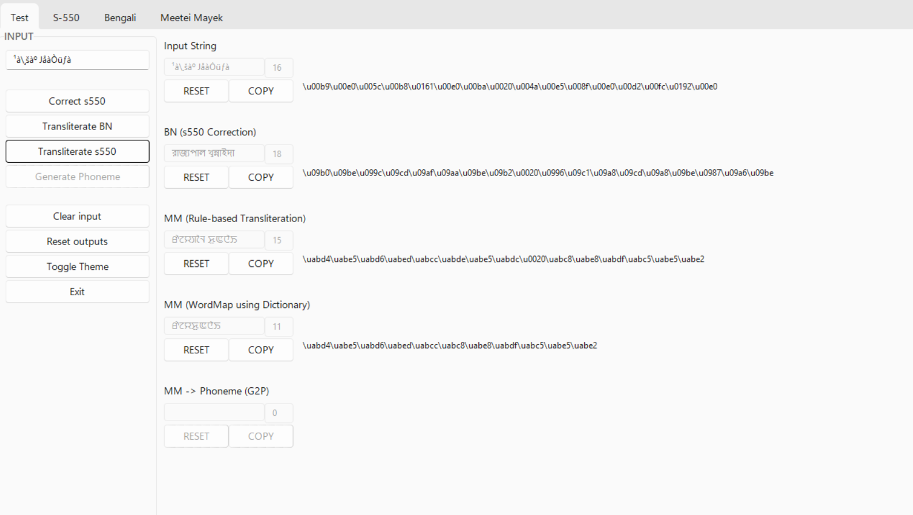
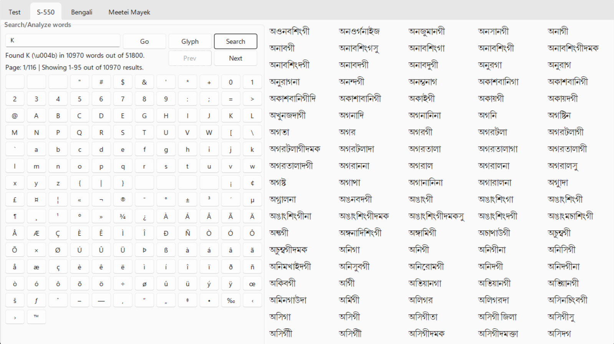
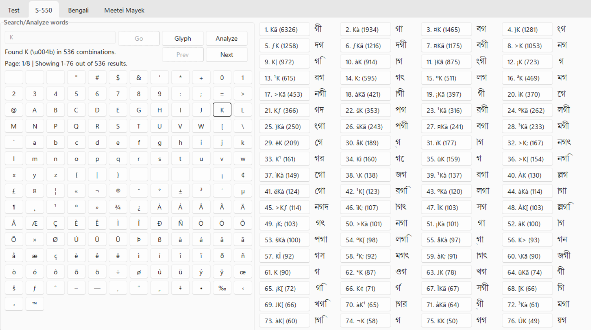
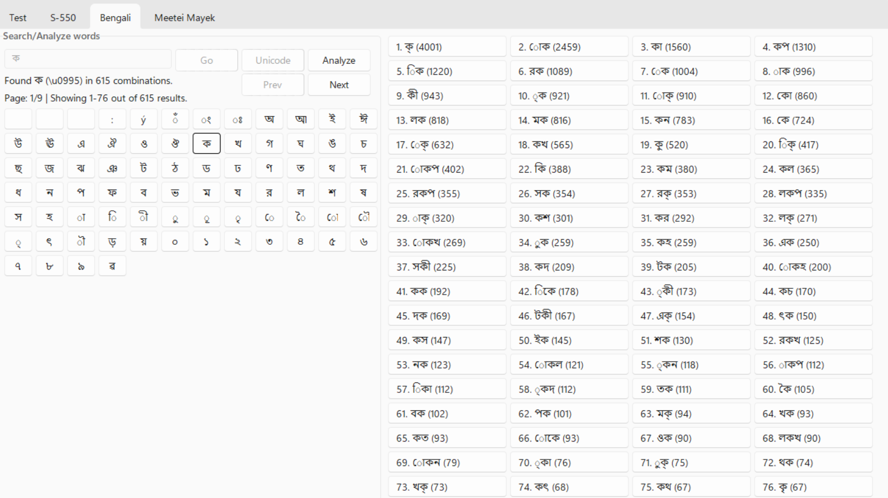
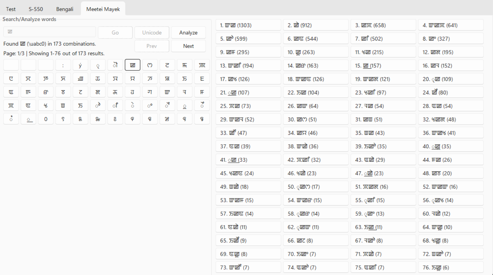

# Manipuri Speech Dataset Tools

This repository contains a collection of tools used to create a Manipuri dataset in both Bengali and Meetei/Meitei Mayek scripts.

## 1. Overview

The project consists of several modules:

| Title               | Description                                                                                                                                 |
| ------------------- | ------------------------------------------------------------------------------------------------------------------------------------------- |
| **Preprocessing**   | Formats news text into raw data suitable for further processing. [+Tokenization]                                                            |
| **Utterance**       | Generates utterance files with utterances and IDs from script text files for s550 glyphs. Also includes utility functions. [+Segmmentation] |
| **Correction**      | Converts s-550 glyphs into correct Bengali Unicode characters.                                                                              |
| **Transliteration** | Transliterates Bengali Unicode to Meetei Mayek Unicode using a rule-based method, supporting transliteration through a wordmap.             |
| **Postprocessing**  | Formats utterance text file into complete words. [+Normalization]                                                                           |
| **GUI Mode**        | Provides a GUI interface to test functions using input strings.                                                                             |
| **Script Mode**     | Offers CLI-based access to essential features.                                                                                              |
| **Dataset**         | The main class containing the project pipeline.                                                                                             |
| **Utils & Config**  | A group of lower level utility functions.                                                                                                   |
| **Describe**        | Describe the dataset including speaker infos.                                                                                               |

## 2. Use Cases

Import the necessary classes and use functions from utils for computation. Here's an example of reading a text file:

- _Using functions from utils:_

```python
from utils.file import fread
...
content = fread(file_path)
```

### 2.1. Preprocessing

Create a `Preprocessing` object and call the `preprocess_file()` method to format the news text from all files stored inside a specific directory into raw text files which can be used as input in further implementations.

- _Initialization_

```python
from steps.preprocessing import Preprocessing
p = Preprocessing()
```

- _Multiple Files in a directory_

```python
for file_path in fget(RAW_S550_DIR):
    content = p.preprocess_file(file_path)
```

### 2.2. Utterance

Create a `Utterance` object and call the `utterance()` method to generate utterances from all files stored inside a specific directory.

- _Initialization_

```python
from steps.utterance import Utterance
u = Utterance()
```

- _All text files in a directory_

```python
for file_path in fget(SCP_S550_DIR):
    content = u.utterance(file_path)
```

### 2.3. Correction

Create a `Correction()` object and call the `correct()`, `correct_script()` or `correct_utterances()` method to generate the correct Bengali unicode from the s-550 glyphs.

- _Initialization_

```python
from correction import Correction
c = Correction()
```

- _String_

```python
output_text = c.correct('text in s550')
```

- _Script file_

```python
content = c.correct_script("path/to/file")
```

- _Utterance file_

```python
content = c.correct_utterances("path/to/file")
```

- _All script files inside a directory_

```python
for file_path in fget("path/to/directory"):
    content = c.correct_script(file_path)
```

- _All utterance files inside a directory_

```python
for file_path in fget("path/to/directory"):
    content = c.correct_utterances(file_path)
```

### 2.4. Transliteration

Create a `Transliteration()` object and call the `transliterate()`, `transliterate_script()` or `transliterate_utterances()` method to generate the correct Meetei Mayek unicode from the Bengali unicode.

- _Initialization_

```python
from transliteration import Transliteration
t = Transliteration()
```

- _String_

```python
output_text = t.transliterate('some text in bengali')
```

- _Script file_

```python
content = t.transliterate_script("path/to/file")
```

- _Utterance file_

```python
content = t.transliterate_utterances("path/to/file")
```

- _All script files inside a directory_

```python
for file_path in fget("path/to/directory"):
    content = t.transliterate_script(file_path)
```

- _All utterance files inside a directory_

```python
for file_path in fget("path/to/directory"):
    content = t.transliterate_utterances(file_path)
```

## 3. GUI Mode

Use the provided GUI through `gui.py` or `main.py -g`.

- The GUI is styled with the [SunValley Theme](https://github.com/rdbende/Sun-Valley-ttk-theme).

### 3.1 **Test Mode**

- **Test Mode** allows testing main features using input strings

  

### 3.2 **Search Mode**

- **Search Mode** helps find words containing a specific character. Available for S-550, Bengali and Meetei Mayek.
- **Search Mode:** S-550 Unicode

  

- **Search Mode:** S-550 Glyph

  

### 3.3 **Analyze Mode**

- **Analyze Mode** helps find different combinations in words containing a specific character, sorted according to count. Available for S-550, Bengali and Meetei Mayek.
- **Analyze Mode:** S-550
  

- **Analyze Mode:** Bengali
  

- **Analyze Mode:** Meetei Mayek
  

### 3.4 **Glyph**

- The `Glyph` function is a powerful tool designed specifically for Windows users in both `Search Mode` and `Analyze Mode`. It plays a crucial role in displaying English Unicode characters used as building blocks for Bengali glyphs, making it an indispensable feature for various users, including AIR, Sangai Express, as well as various news agencies and press clubs.

### **Last Update Changes:**

1. **Completed Pagination of Search/Analyze Results**

   - We have successfully implemented pagination for both Search and Analyze results, making it easier to navigate through large datasets.

2. **Additional Tabs for Analysis**

   - We have added additional tabs to enhance the analysis experience, providing users with more options and functionalities.

3. **Fixed Unsynchronized States of UI with Data**

   - We addressed issues related to UI and data synchronization, ensuring that the user interface accurately reflects the underlying data.

4. **Fixed Glyphs Not Working When Page is Navigated**

   - We resolved an issue where glyphs were not rendering correctly when navigating between pages, ensuring a seamless user experience.

5. **Fixed Reactivity Issue with Button Commands**

   - We have fixed reactivity issues related to button commands, making sure that all actions trigger the expected responses.

6. **Increased Reusability and Renamed Existing Methods**

   - To enhance code maintainability, we've added more methods and improved the naming conventions of existing methods.

7. **Improved Decoupling**

   - We've improved the decoupling of components within the codebase, promoting modularity and ease of development.

8. **Reduced Use of tkinter Trace to Resolve Memory Leaks**

   - To address memory leak concerns, we've reduced the usage of tkinter trace, ensuring more efficient resource management.

9. **Fixed Appearance of Previous Page Content in Results**

   - We've corrected a bug where previous page content was erroneously displayed in search and analyze results.

10. **Fixed UI of Analyze Displayed with Data from Search and Vice Versa:**

    - We've resolved an issue where the user interface was displaying data from the wrong mode (Search or Analyze).

11. **Disabled Pagination Button at Start and End of Pages**

    - Pagination buttons are now disabled at the start and end of pages when there is no more content to display.

12. **Disabled Manual Input for Analyze Mode**

    - In Analyze mode, manual input has been disabled to prevent user errors and ensure data integrity.

13. **Changed Toggle to Display When a Custom Font is Used to Render `Glyphs`**

    - A toggle has been introduced to indicate when a custom font is being used to render glyphs, providing users with transparency regarding font settings.

14. **Replaced Search Button with Go Button**

    - The `search` button has been replaced with a `Go` button, which provides a more intuitive action for initiating searches.

15. **Added Mode Button to Toggle Between Analyze and Search**

    - A `Mode` button has been added to allow users to easily switch between Analyze and Search modes, enhancing user flexibility.

16. **Disabled Go Button When Input is Empty**

    - The `Go` button is now disabled when there is no input, preventing unnecessary actions and improving user experience.

17. **Reflect Changes When Mode is Toggled Between Search and Analyze**

    - Changes to the user interface and functionality are now immediately reflected when toggling between `Search` and `Analyze` modes.

18. **Removed words.txt and chars.txt from gitignore**

    - To expedite testing, we've removed `words.txt` and `chars.txt` from gitignore, allowing for immediate testing of `Search` and `Analyze` functionality.

19. **Automatically Created Resources at Start of GUI**

    - Resources are now automatically generated at the start of the GUI, eliminating the need to run the `main.py` script before `gui.py`, streamlining the development process.

20. **Other UI Changes**

For any additional information or inquiries, please refer to the accompanying code documentation or open an issue.

## 4. Script Mode

You can use the script mode for different functions.

### 4.1. Main Scripts

These are the primary scripts that can be executed:

- `main.py`: Run the main script.
- `gui.py`: Run the GUI (Graphical User Interface) script.
- `desscribe.py`: Run the Describe script to analyze the dataset.

### 4.2. Main Script with Options

You can use the `main.py` script with additional options:

- `main.py -g`: Run the main script with GUI mode enabled.
- `main.py -d`: Run the main script with describe mode enabled.

### 4.3. Correction Script

The `correction.py` script is used for text correction:

- `correction.py string`: Correct a single string.
- `correction.py -f path/to/file`: Correct text in a file
- `correction.py -d path/to/dir`: Correct text in files within a directory.

### 4.4. Transliteration Script

The `transliteration.py` script is used for text transliteration:

- `transliteration.py string`: Transliterate a single string.
- `transliteration.py -f path/to/file`: Transliterate text in a file.
- `transliteration.py -d path/to/dir`: Transliterate text in files within a directory.
- `transliteration.py string -w path/to/wordmap`: Transliterate a string using a custom wordmap.
- `transliteration.py -f path/to/file -w path/to/wordmap`: Transliterate text in a file using a custom wordmap.
- `transliteration.py -d path/to/dir -w path/to/wordmap`: Transliterate text in files within a directory using a custom wordmap.

## 5. Directory Structure

The project's directory structure is organized as follows:

- `config`, `data`, `generated`, `local`, `res`, `steps`, `theory`, `output`, and `utils` folders containing various modules.
- Different subfolders within `data`, `res`, and `utils` for better organization.
- Configuration files, text files, scripts, and resource files are appropriately placed.

## 6. Known Issues

The project has identified issues that need resolution:

- Preprocessing cannot ignore `UnicodeDecodeError` characters in RTF files encoded in `cp1252`.
- Correction may have issues with characters with virama.
- Transliteration algorithm might skip last two characters.
- Transliteration might fail to identify coda as lonsum for non-virama clusters.

## 7. New Approach

A new approach aims to process words instead of entire files:

1. Divide meaningful sentences during preprocessing.
2. Perform correction and transliteration at the word level.
3. Target invisible characters for correction.

Extra:

- ¡ is used to transform d to u i.e., l is d -> l¡ü is u, And ü is dependent suffix.
- for spelling of words like security
  - vowel is repeated (u and uu) change it to u
  - position in s550 is at the left but on bn it is at the right (which is correct).

## See also

- [SunValley Theme](https://github.com/rdbende/Sun-Valley-ttk-theme).
- [Loading Custom Fonts in Tkinter for Windows](<https://msdn.microsoft.com/en-us/library/dd183327(VS.85).aspx>).
