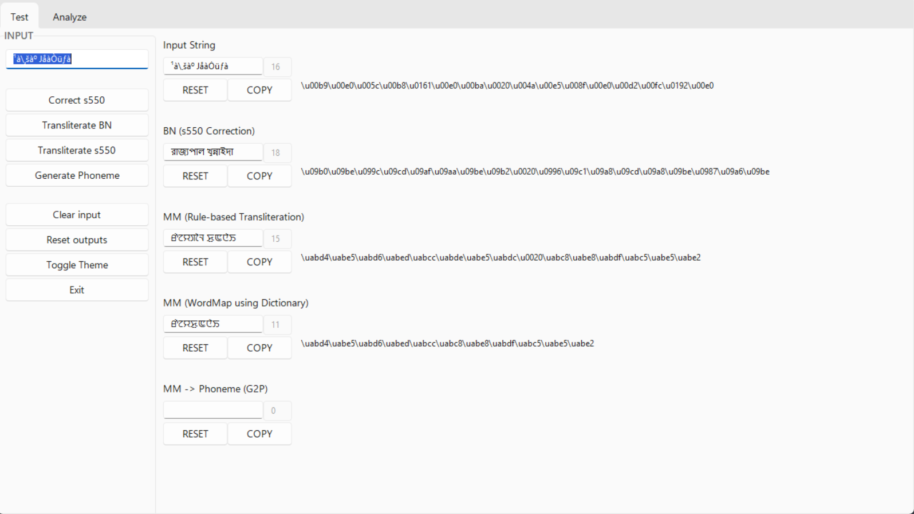
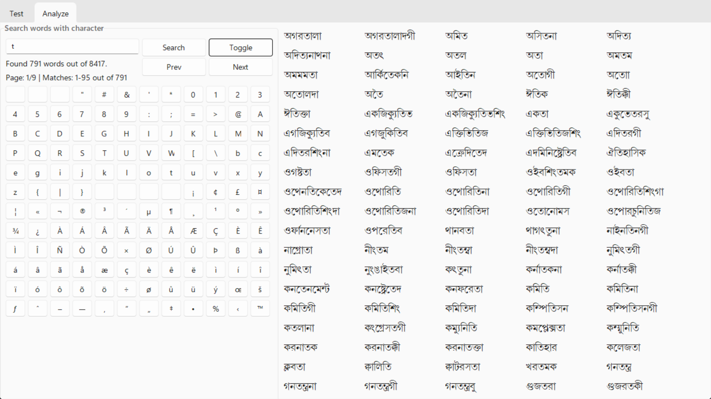

# speech_dataset

A Set of Tools used in creating Manipuri Dataset in both Bengali and Meetei/Meitei Mayek Script.

## 0. Short Description

| Title | Description | Type | Status |
|-----------|--------|--------|---------|
| **Preprocessing**  | To format the news by `preprocess()` into raw data which can be passed in the main function.  | _class_ | Completed |
| **Utterance** | To generate `utterance()` file which contains utterances along with id from the script text file/text for s550 glyphs. It also contains utilities function which are important in the main project. | _class_ | Completed |
| **Correction** |  To `correct()` the file/text with s-550 glyphs into the correct Bengali unicode characters.   | _class_  | About to Complete |
| **Transliteration** | To `transliterate()` the Bengali unicode to Meetei Mayek Unicode using a Rule based Transliteration method. It also supports transliteration through a `wordmap()`. | _class_  | Underway |
| **GUI Mode** | GUI Mode to test the functions by passing strings. | _script_  | Completed |
| **Script Mode** | Script Mode for all important features to be used through CLIs.   | _script_  | Underway |
| **DatasetProject** | Main class with a `run()` method which contains the project pipeline.   | _script_  | Underway |
| **Utils** | Base class with all utilities function as well as a framework for all the main classes.   | _class_  | Completed |

## 1. Use Cases

Import whichever classes are necessary (Always import Utils or inherit from it). An example of reading text file is given below:

- Using Utils as Utility class (as almost all methods are static methods)

```python
from utils.utils import Utils
...
content = Utils.read_text_file(file_path)
```

- Inheriting from Utils (to create consistency with different functions and avoiding unnecessary boilerplate codes)

```python
from utils.utils import Utils
class MyClass(Utils):
    ...
    def some_method():
        content = self.read_text_file(file_path)
        ...
```

### 1.1. Preprocessing

Create a `Preprocessing` object and call the `preprocess_files()` method to format the news text from all files stored inside a specific directory into raw text files which can be used as input in further implementations.

- Initialization

```python
from steps.preprocessing import Preprocessing
p = Preprocessing()
```

- Multiple Files in a directory

```python
for idx, file_path in enumerate(files):
    content = p.preprocess_file(file_path=file_path, idx=idx)
```

### 1.2. Utterance

Create a `Utterance` object and call the `utterance_files()` method to generate utterances from all files stored inside a specific directory.

- Initialization

```python
from steps.utterance import Utterance
u = Utterance()
```

- Multiple Files in a directory

```python
files = Utils.get_files(dir=SCP_S550_DIR)
for idx, file_path in enumerate(files):
    content = u.utterance_file(file_path=file_path, idx=idx)
```

### 1.3. Correction

Create a `Correction()` object and call the `correct()` method to generate the correct Bengali unicode from the s-550 glyphs.

- Initialization

```python
from correction import Correction
c = Correction()
```

- String

```python
output_text = c.correct('some text in s550')
```

- File

```python
content = c.correct_file(file="path_to_file")
```

- Files inside a directory

```python
files = Utils.get_files(dir=path/to/directory)
for idx, file_path in enumerate(files):
    content = c.correct_file(file_path=file_path, idx=idx)
```

### 1.4. Transliteration

- Initialization

```python
from transliteration import Transliteration
t = Transliteration()
```

- String

```python
output_text = t.transliterate('some text in bengali')
```

- Single file

```python
content = t.transliterate_file(file="path_to_file")
```

- All files inside a directory

```python
files = Utils.get_files(dir=path/to/directory)
for idx, file_path in enumerate(files):
    content = t.transliterate_file(file_path=file_path, idx=idx)
```

## 2. GUI Mode

You can use GUI through `gui.py` or `main.py -g`

- Uses [SunValley Theme](https://github.com/rdbende/Sun-Valley-ttk-theme).

- __Test__ (Test main features using input string)



- __Analyze__ (Find words containing the entered character)



- Toggle Function in Analyze mode is currently available for only Windows at the moment.

## 3. Script Mode

| Function | Input Type | Command |
|-----------|--------|--------|
| **Correction**  | String | `correction.py string` |
| **Correction**  | File | `correction.py -f path/to/file` |
| **Correction**  | Files inside a directory | `correction.py -d path/to/dir` |
| **Transliteration (Rule-based)**  | String | `transliteration.py string` |
| **Transliteration (Rule-based)**  | File | `transliteration.py -f path/to/file` |
| **Transliteration (Rule-based)**  | Files inside a directory | `transliteration.py -d path/to/dir` |
| **Transliteration (WordMap)**  | String | `transliteration.py string -w path/to/wordmap` |
| **Transliteration (WordMap)**  | File | `transliteration.py -f path/to/file -w path/to/wordmap` |
| **Transliteration (WordMap)**  | Files inside a directory | `transliteration.py -d path/to/dir -w path/to/wordmap` |

## 4. Directory Structure

```bash
├── config
│ └── paths.py
├── data
│ ├── */*.rtf
│ ├── */*/*.txt
│ └── */*.wav
├── local
│ └── */*.py
├── res
│ ├── */*/*.csv
│ └── */*/*.json
├── steps
│ ├── clusters.py
│ ├── preprocessing.py
│ ├── res.py
│ └── utterance.py
├── theory
│ ├── Language_data_research.docx
│ └── Language_data_research.pdf
├── output
│ ├── */*.md
├── utils
│ ├── charset
│ │ ├── images
│ │ │ └── *.png
│ │ └── README.md
│ ├── fonts
│ │ ├── fontloader.py
│ │ └── S-550.TTF
│ ├── gui
│ │ ├── analyze_frame.py
│ │ ├── components.py
│ │ └── test_frame.py
│ ├── keyboard
│ │ ├── images
│ │ │ └── *.png
│ │ ├── khut_e.zip
│ │ └── README.md
│ ├── position.py
│ ├── resource_bank.py
│ ├── syllabic.py
│ └── utils.py
├── .gitignore
├── correction.py
├── dataset.py
├── gui.py
├── LICENSE
├── main.py
├── README.md
├── requirements.txt
└── transliteration.py
 
```

### 4.1. Data Directory

```bash
├── data
│ ├── bn
│ │ ├── chars
│ │ │ └── chars.txt
│ │ ├── script
│ │ │ └── *.txt
│ │ ├── txt
│ │ │ └── text.txt
│ │ ├── utt
│ │ │ └── *.txt
│ │ └── words
│ │   └── words.txt
│ ├── mm
│ │ ├── chars
│ │ │ └── chars.txt
│ │ ├── script
│ │ │ └── *.txt
│ │ ├── txt
│ │ │ └── text.txt
│ │ ├── utt
│ │ │ └── *.txt
│ │ └── words
│ │   └── words.txt
│ ├── raw
│ │ └── *.txt
│ ├── rtf
│ │ └── *.rtf
│ ├── s550
│ │ ├── chars
│ │ │ └── chars.txt
│ │ ├── script
│ │ │ └── *.txt
│ │ ├── txt
│ │ │ └── text.txt
│ │ ├── utt
│ │ │ └── *.txt
│ │ └── words
│ │   └── words.txt
│ ├── wav
│ │ └── *.wav
```

### 4.2. Resource Directory

```bash
├── res
│ ├── alphabet
│ │ └── *.json
│ ├── correction
│ │ └── *.json
│ ├── info
│ │ ├── *.json
│ │ └── *.txt
│ ├── transliteration
│ │ └── *.json
│ └── wordmap
│   ├── *.csv
│   └── *.json
```

## 5. Known Issues

There are few issues which needs to be resolved.

- Preprocessing
  - Cannot ignore the `UnicodeDecodeError` characters in RTF file which were encoded in `cp1252` as the actual `utf-8` characters are used as s550 glyphs.

- Correction
  - Some characters has virama which should not have been there.
  - One character from s550 appears as bn which is incorrect.

- Transliteration

  - last two characters skipped, fix the algorithm.
  - cannot identify coda as lonsum in case of non-viramma clusters.

## 6. Target

- for spelling like security
  - vowel is repeated (u and uu) change it to u
  - position in s550 is at the left but on bn it is at the right.


## 7. New Approach

Target invisible characters
1. ¡
- Is used to transform d to u i.e., l is d -> l¡ü is u, And ü is dependent suffix.
