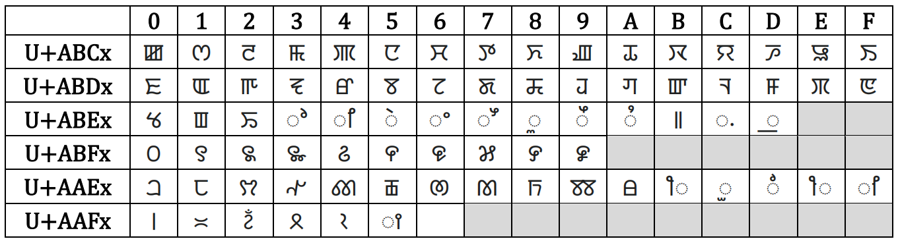
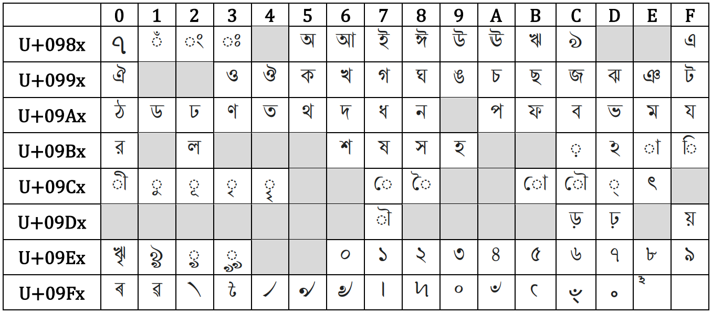
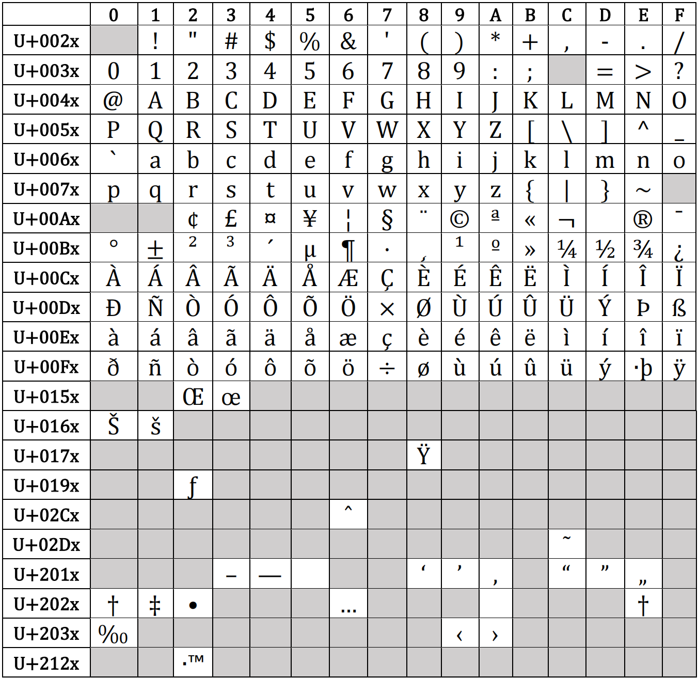

# speech_dataset / utils / charset

## 1. Unicode Character Set

The actual unicode values can be read from row index of which the last letter 'x' is replaced by the column index of the specific character.

### 1.1. Meetei Mayek

### 1.2. Bengali

### 1.3. Actual Glyph of s550

### 1.4. s550 Glyph

